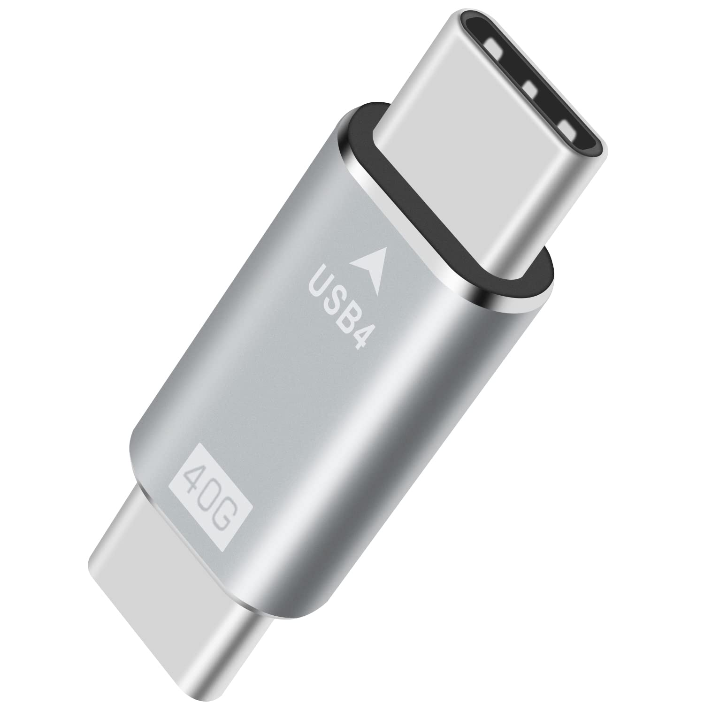

# Conector externo: USB‑C (USB4/PD)

**Descripción breve:** Conector reversible para datos, vídeo y alimentación (USB Power Delivery).
**Pines/Carriles/Voltajes/Velocidad:** 24 pines · hasta 40 Gbps (USB4) · PD hasta 240 W (según perfil)
**Uso principal:** Carga y conexión de periféricos/monitores/docks.
**Compatibilidad actual:** Alta (ojo: no todo USB‑C soporta USB4, TB o PD completos).

## Identificación física

- Conector ovalado y simétrico; símbolos frecuentes: rayo (Thunderbolt), “SS” (SuperSpeed) o “40G”/“240W” en cables.

## Notas técnicas

- Aunque USB‑C es el tipo de conector, **USB4** es el estándar de datos que puede usar ese conector; muchos puertos USB‑C no alcanzan 40 Gbps ni los 240 W de PD.
- Para alcanzar los 40 Gbps o 240 W es necesario que tanto el puerto, el host/dispositivo y el cable estén certificados para USB4 y PD «Extended Power Range».

## Fotos

## Fuentes

[https://www.cablematters.com](https://www.cablematters.com)
[https://www.hp.com](https://www.hp.com)
[https://www.usb.org](https://www.usb.org)
