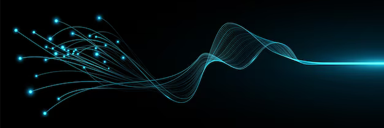
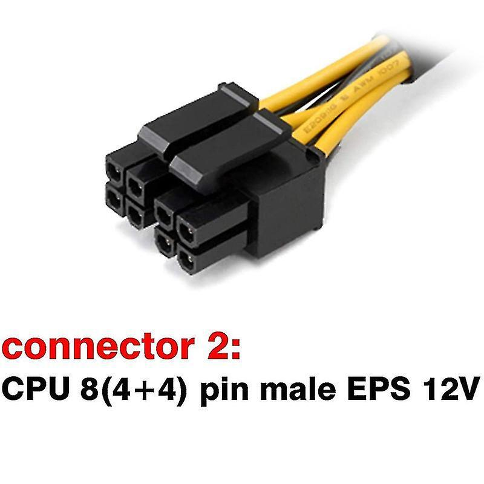
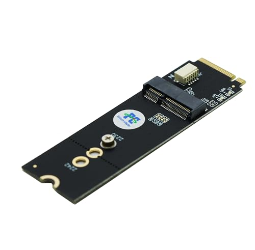
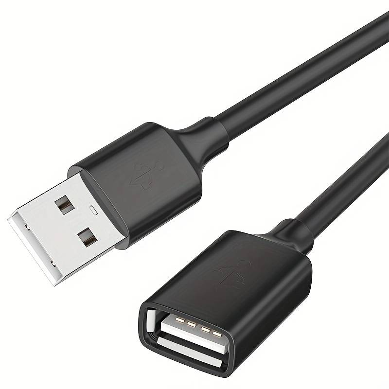
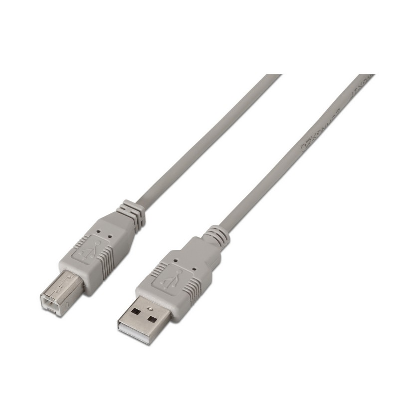

# ENTREGA ÚNICA - Reto 01

> Borrueco_Lorite_Javier_FHW01_Tarea

## Índice

- [Portada](#portada)
- [1. Introducción](#1-introduccion)
- [2. Conectores internos (energía)](#2-conectores-internos-energia)
- [3. Conectores de datos](#3-conectores-de-datos)
- [4. Slots de expansión](#4-slots-de-expansion)
- [5. Conectores externos](#5-conectores-externos)
- [6. Bibliografía](#6-bibliografia)

## Portada

# Reto 1 — Investigación_Desarrollo_Conectores_Slots

**Módulo:** Fundamentos de Hardware (ASIR)
**Alumno/a:** Javier Borrueco Lorite
**Curso:** 2025/26

## 1. Introducción

Piensa el PC como una **ciudad**:

- **Conectores** = **carreteras y puentes** (energía y datos).
- **Slots** = **parcelas** para ampliar (tarjetas).

Objetivo del reto: **identificar** y **explicar** conectores/slots **actuales** y, si procede, **legacy** aún en uso.

## 2. Conectores internos (energía)

# Conector: PCIe 6/8p

**Descripción breve:** Conector auxiliar de alimentación para tarjetas gráficas con interfaz PCI Express que requieren más de la potencia que ofrece la ranura.
**Pines/Carriles/Voltajes/Velocidad:** 6 pines · +12 V (≈ 75 W) / 8 pines · +12 V (≈ 150 W)
**Uso principal:** Suministro extra de energía a tarjetas gráficas de elevado consumo.
**Compatibilidad actual:** Muy alta; muchas fuentes modernas tienen conectores 6+2 para cubrir 6 y 8 pines.

## Identificación física

- Conector rectangular de 6 u 8 contactos (normalmente 6 pines + 2 suplementarios) con clip de sujección; se conecta al cable de la fuente y a la tarjeta gráfica.

## Notas técnicas

- En el conector de 8 pines se utilizan pines de “sense” que informan a la tarjeta gráfica de la disponibilidad del conector completo.
- El estándar indica que el de 6 pines entrega hasta ~75 W y el de 8 pines ~150 W; conectar un 6 pines en un zócalo adecuando la tarjeta necesita los 150 W puede ser inadecuado.

## Fotos

# Conector: 12VHPWR / 12V‑2x6

**Descripción breve:** Conector de alimentación de alta potencia para tarjetas gráficas modernas, capaz de entregar hasta ~600 W por conector.
**Pines/Carriles/Voltajes/Velocidad:** 16 pines (12 de potencia + 4 de señales) · +12 V principal · hasta ~55 A (~600 W).
**Uso principal:** Suministro dedicado de energía a GPUs de gama alta que requieren más de lo que un conector PCIe tradicional 8‑pines puede proporcionar.
**Compatibilidad actual:** Muy alta en GPUs modernas compatibles con el estándar PCI‑SIG / ATX 3.0 / PCIe 5.0, aunque debe comprobarse que la fuente y cable están certificados para esta potencia.

## Identificación física

- Conector rectangular de 16 contactos en dos filas (12 pines para potencia + 4 pines “sense”/señal) en el lado del dispositivo, con clip de fijación. La variante 12V‑2x6 modifica la versión anterior para mayor fiabilidad.

## Notas técnicas

- El estándar 12VHPWR introdujo “pines de sentido” para que la GPU detecte la capacidad de la fuente y limite el consumo.
- La revisión 12V‑2x6 reduce la longitud de los pines de señal (“sense pins”) y alarga los de potencia para mejorar el acoplamiento y prevenir conexiones parciales que pueden conllevar sobrecalentamiento.

## Fotos

# Conector: ATX de 24 pines

**Descripción breve:** Conector principal que alimenta la placa base en sistemas ATX/ATX12V.
**Pines/Carriles/Voltajes/Velocidad:** 24 pines · +3.3V, +5V, +12V
**Uso principal:** Alimentación de la placa base
**Compatibilidad actual:** Alta

## Identificación física

- Bloque rectangular de 24 pines con clip, situado en el borde de la placa base.

## Notas técnicas

- Estándar ATX12V 2.x. No confundir con el EPS de CPU (4/8 pines).

## Fotos

# Conector: EPS de 8 pines (4+4)

**Descripción breve:** Conector auxiliar de 12 V para alimentar la CPU en fuentes de alimentación tipo EPS12V/ATX12V.
**Pines/Carriles/Voltajes/Velocidad:** 8 pines · +12 V (todos los pines suministran +12 V o parte de ellos)
**Uso principal:** Alimentación dedicada de la CPU en placas base de alto rendimiento o servidores.
**Compatibilidad actual:** Alta, especialmente en placas modernas que requieren >144 W para CPU; soporta también versión 4+4 para compatibilidad con conector de 4 pines.

## Identificación física

- Conector rectangular de 8 pines, a menudo dividido en dos bloques de 4 pines (“4+4”) para compatibilidad; usualmente cerca del zócalo CPU en la placa base.

## Notas técnicas

- Estándar EPS12V (ha evolucionado desde ATX12V) y permite mayor corriente al rail de +12 V.
- Los bloques 4+4 permiten uso en placas con conector de 4 pines cuando no se necesita toda la capacidad.

## Fotos

# Conector: SATA Power

**Descripción breve:** Conector de alimentación para unidades de almacenamiento SATA (HDD/SSD/ópticas).
**Pines/Carriles/Voltajes/Velocidad:** 15 pines · +3,3 V, +5 V, +12 V
**Uso principal:** Alimentación de discos y unidades ópticas con interfaz SATA.
**Compatibilidad actual:** Muy alta en sistemas modernos; reemplaza al conector Molex de 4 pines para dispositivos internos SATA.

## Identificación física

- Conector alargado de 15 contactos, tipo «wafer», normalmente unido al cable de alimentación de la fuente, se conecta a la unidad SATA.

## Notas técnicas

- Cada voltaje (+3,3 V, +5 V, +12 V) tiene varios pines en paralelo para mayor corriente; uno de los pines puede usarse para la función PWDIS (Power Disable) en la revisión SATA 3.3.
- Aunque se incluye la línea de +3,3 V, muchos dispositivos SATA no la usan, y adaptadores Molex→SATA que no tienen +3,3 V siguen siendo muy comunes.

## Fotos

## 3. Conectores de datos

# Conector de datos: SATA

**Descripción breve:** Interfaz de datos en serie para conectar HDD/SSD/unidades ópticas.
**Pines/Carriles/Voltajes/Velocidad:** 7 pines · 1,5/3/6 Gbps (SATA I/II/III)
**Uso principal:** Conexión de almacenamiento interno común.
**Compatibilidad actual:** Alta

## Identificación física

- Conector plano en forma de L; cable delgado de hasta ~1 m de longitud típico.

## Notas técnicas

- Utiliza señal diferencial (dos pares de datos + tres tierras) para menor interferencia.{index=1}
- No lleva alimentación; la unidad obtiene energía a través del conector de alimentación SATA.

## Fotos

# Conector de datos: M.2 (NVMe/SATA)

**Descripción breve:** Formato compacto de conectividad para módulos SSD internos, que puede usar la interfaz SATA o PCIe (NVMe).
**Pines/Carriles/Voltajes/Velocidad:** 67 pines (depende del socket) · soporta SATA hasta ~6 Gbps o PCIe (x2, x4) con velocidades mucho mayores.
**Uso principal:** Conexión de unidades de estado sólido de alto rendimiento en formato pequeño (portátiles, placas base modernas).
**Compatibilidad actual:** Muy alta en equipos recientes; asegurarse de que la ranura soporta SATA o PCIe según el módulo.

## Identificación física

- Tarjeta‑módulo delgada (normalmente 22 mm de ancho), insertada en ranura M.2 en la placa base, con “notch” (muesca) de clave B, M o B+M para indicar compatibilidad.

## Notas técnicas

- El mismo conector M.2 puede soportar diferentes protocolos (SATA, PCIe/NVMe) dependiendo de la ranura.
- Los módulos SATA suelen usar clave B o B+M; los que sólo soportan PCIe/NVMe usan clave M.

## Fotos

## 4. Slots de expansión

# Slot: M.2(Wi-Fi/BT)

**Descripción breve:** Ranura compacta para módulos inalámbricos internos como Wi-Fi y Bluetooth.
**Pines/Carriles/Voltajes/Velocidad:** 67 pines · PCIe x1 o USB 2.0/3.0 según módulo
**Uso principal:** Tarjetas de red Wi-Fi y Bluetooth internas en portátiles y PCs de sobremesa.
**Compatibilidad actual:** Alta en placas modernas con ranura M.2 Key-E

## Identificación física

- Ranura corta, estrecha (22 mm de ancho) con “notch” de clave E; cerca del borde de la placa base.

## Notas técnicas

- M.2 Key-E soporta señal PCIe x1 y/o USB según el módulo; no es compatible con SSD NVMe (Key-M) directamente.

## Fotos

# Slot: PCI Express (x1/x4/x8/x16; Gen3/4/5)

**Descripción breve:** Ranura de expansión versátil para GPUs, tarjetas de red, SSD NVMe en adaptadores y otros dispositivos.
**Pines/Carriles/Voltajes/Velocidad:** x1/x4/x8/x16 carriles · Gen3 8 GT/s · Gen4 16 GT/s · Gen5 32 GT/s
**Uso principal:** Tarjetas gráficas, aceleradoras, tarjetas de expansión y almacenamiento NVMe vía adaptador.
**Compatibilidad actual:** Muy alta en placas modernas; depende del número de carriles soportados por CPU/Chipset.

## Identificación física

- Ranura de longitud variable según carriles (x1 corta, x16 larga) con pestaña de retención; color variable por fabricante.

## Notas técnicas

- Ancho de banda efectivo depende de la generación y el número de carriles disponibles; retrocompatible con generaciones y tamaños menores.

## Fotos

## 5. Conectores externos

# Conector externo: DisplayPort 1.4/2.x

**Descripción breve:** Interfaz digital para transmitir vídeo y audio de alta definición, soporte para múltiples monitores y resoluciones hasta 8K.
**Pines/Carriles/Voltajes/Velocidad:** 20 pines · hasta 32.4 Gbps (DP 1.4) / 80 Gbps (DP 2.0) · soporte para HDR, tasas de refresco altas y color profundo.
**Uso principal:** Conexión de monitores, estaciones de trabajo, pantallas profesionales y tarjetas gráficas.
**Compatibilidad actual:** Muy alta en equipos modernos; retrocompatible con versiones anteriores mediante adaptadores pasivos o activos.

## Identificación física

- Conector rectangular con un lado biselado; clip de retención opcional. Color negro/gris según fabricante.

## Notas técnicas

- DP 1.4 soporta HBR3 (High Bit Rate 3) para resoluciones hasta 8K@60Hz o 4K@120Hz.
- DP 2.x usa modo UHBR (Ultra High Bit Rate) para hasta 80 Gbps, soporte Display Stream Compression (DSC 1.2a) y multistream para múltiples monitores.
- Compatible con adaptadores pasivos HDMI, DVI y VGA con ciertas limitaciones de ancho de banda.

## Fotos

# Conector externo: HDMI 2.1

**Descripción breve:** Interfaz digital para transmitir audio y vídeo de alta definición, incluyendo 4K/8K y HDR.
**Pines/Carriles/Voltajes/Velocidad:** 19 pines · hasta 48 Gbps (modo FRL) · soporta resoluciones 4K@120Hz, 8K@60Hz.
**Uso principal:** Conexión de monitores, televisores, proyectores y consolas de última generación.
**Compatibilidad actual:** Muy alta en dispositivos recientes; HDMI 2.1 retrocompatible con 2.0 y 1.4.

## Identificación física

- Conector rectangular de 19 pines, ligeramente trapezoidal; color negro/gris según fabricante.

## Notas técnicas

- HDMI 2.1 introduce modos de mayor ancho de banda (FRL) para soportar 8K y tasas de refresco altas.
- Compatible con eARC (canal de retorno de audio mejorado) y Dynamic HDR.

## Fotos

# Conector externo: RJ‑45 (Ethernet 1G/2.5G/10G)

**Descripción breve:** Conector modular para redes Ethernet de diferentes velocidades.
**Pines/Carriles/Voltajes/Velocidad:** 8 pines (4 pares) · 1 Gbps / 2.5 Gbps / 10 Gbps según cable y equipo · alimentación opcional PoE (Power over Ethernet) 15–90 W según estándar.
**Uso principal:** Conexión a redes locales (LAN), routers, switches, PCs, servidores.
**Compatibilidad actual:** Muy alta; estandarizado y retrocompatible con versiones anteriores (10/100/1000 Mbps).

## Identificación física

- Conector rectangular con clip de retención; 8 contactos dorados alineados en una fila.
- Cables típicos: Cat5e, Cat6, Cat6a, Cat7, Cat8 según velocidad requerida.

## Notas técnicas

- PoE permite alimentar dispositivos como cámaras IP o puntos de acceso mediante el mismo cable.
- Longitud máxima de cable para 10 GbE sobre cobre: 55–100 m según categoría del cable.
- Retrocompatible: un puerto 10 GbE funciona con cables 1 GbE o 2.5 GbE si se negocia automáticamente la velocidad.

## Fotos

# Conector externo: USB‑A (USB 2.0/3.x)

**Descripción breve:** Conector rectangular tipo “amo” y “hembra” ampliamente usado para periféricos y cables de datos/energía.
**Pines/Carriles/Voltajes/Velocidad:** USB 2.0: 4 pines · hasta 480 Mbps · estándar; USB 3.x: 9 pines (o más según versión) · 5 Gbps (USB 3.0) o más en 3.1/3.2.
**Uso principal:** Conexión de periféricos (ratón, teclado, pendrive, discos externos) y carga de dispositivos.
**Compatibilidad actual:** Muy alta; casi todas las placas tienen al menos puertos USB‑A; versiones 3.x en muchos PCs modernos.

## Identificación física

- Conector tipo A: forma rectangular, normalmente con lengüeta plástica de color negro (USB 2.0) o azul/turquesa (USB 3.x) según fabricante.

## Notas técnicas

- Aunque el conector USB‑A tenga forma idéntica en USB 2.0 y USB 3.x, la velocidad real dependerá de la versión del estándar y del equipo al que se conecte.
- USB 3.x añade más líneas de datos (más pines) y soporte de lectura/escritura simultáneas (“full‑duplex”) comparado con USB 2.0 que era half‑duplex.

## Fotos

# Conector externo: USB‑B (USB 2.0/3.x)

**Descripción breve:** Conector cuadrado (tipo B) usado principalmente en impresoras, escáneres y dispositivos periféricos que reciben alimentación.
**Pines/Carriles/Voltajes/Velocidad:** USB 2.0: 4 pines · hasta 480 Mbps · estándar; USB 3.x: 9 pines · hasta 5–10 Gbps según versión.
**Uso principal:** Conectar periféricos a un host, transferencia de datos y alimentación limitada.
**Compatibilidad actual:** Alta en equipos con impresoras/escáneres y algunos discos externos.

## Identificación física

- Conector cuadrado con esquinas biseladas; USB 3.x suele tener parte extra para los pines adicionales y color azul o negro.

## Notas técnicas

- La forma física impide conectar un USB‑B en un puerto USB‑A.
- USB 3.x añade pines extra para comunicación bidireccional simultánea y mayor velocidad de transferencia.

## Fotos

# Conector externo: USB‑C (USB4/PD)

**Descripción breve:** Conector reversible para datos, vídeo y alimentación (USB Power Delivery).
**Pines/Carriles/Voltajes/Velocidad:** 24 pines · hasta 40 Gbps (USB4) · PD hasta 240 W (según perfil)
**Uso principal:** Carga y conexión de periféricos/monitores/docks.
**Compatibilidad actual:** Alta (ojo: no todo USB‑C soporta USB4, TB o PD completos).

## Identificación física

- Conector ovalado y simétrico; símbolos frecuentes: rayo (Thunderbolt), “SS” (SuperSpeed) o “40G”/“240W” en cables.

## Notas técnicas

- Aunque USB‑C es el tipo de conector, **USB4** es el estándar de datos que puede usar ese conector; muchos puertos USB‑C no alcanzan 40 Gbps ni los 240 W de PD.
- Para alcanzar los 40 Gbps o 240 W es necesario que tanto el puerto, el host/dispositivo y el cable estén certificados para USB4 y PD «Extended Power Range».

## Fotos

## 6. Bibliografía

[https://pinoutguide.com](https://pinoutguide.com)
[https://www.lifewire.com](https://www.lifewire.com)
[https://www.moddiy.com](https://www.moddiy.com)
[https://help.corsair.com](https://help.corsair.com)
[https://www.ultralibrarian.com](https://www.ultralibrarian.com)
[https://pcisig.com](https://pcisig.com)
[https://www.snia.org](https://www.snia.org)
[https://en.wikipedia.org](https://en.wikipedia.org)
[https://www.cablematters.com](https://www.cablematters.com)
[https://www.hp.com](https://www.hp.com)
[https://www.usb.org](https://www.usb.org)
[https://www.geeksforgeeks.org](https://www.geeksforgeeks.org)
[https://www.xataka.com](https://www.xataka.com)
[https://www.anker.com](https://www.anker.com)
[https://www.techtarget.com](https://www.techtarget.com)
[https://www.cablinginstall.com](https://www.cablinginstall.com)
[https://www.tek.com](https://www.tek.com)
[https://vesa.org](https://vesa.org)
