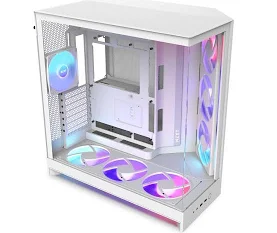

# Reto 02 — Análisis de Chasis (UT2 · RA1)

## 1) Tabla comparativa de materiales

| Material         | Ventajas                                                                | Desventajas                                       | Aplicaciones comunes                                    |
| ------------------ | ------------------------------------------------------------------------- | --------------------------------------------------- | --------------------------------------------------------- |
| Acero SECC       | Resistente, fácil de fabricar, económico y duradero                   | Pesado y puede corroerse                          | Chasis de PC y bastidores industriales                  |
| Aluminio         | Ligero, buen conductor térmico, resistente a la corrosión y estético | Menos resistente que el acero y más caro         | Carcasas de portátiles, chasis compactos y smartphones |
| Plástico        | Ligero, fácil de moldear, aislante y económico                        | Menor resistencia, se raya y se deforma con calor | Carcasas externas, ventiladores y soportes internos     |
| Vidrio templado  | Estético, transparente y resistente a rayaduras                        | Frágil ante impactos y pesado                    | Paneles laterales de PC y protectores de pantalla       |
| Materiales comp. | Alta resistencia, ligero y propiedades personalizadas                   | Más caro y difícil de reciclar                  | Chasis de gama alta, portátiles premium y drones       |

## 2) Formatos: diagrama y análisis

**Formatos elegidos:** Torre Gaming vs Torre Workstation

## Diagrama

## Impacto del tamaño

- **Capacidad de componentes:**

  - Torre Gaming: GPUs largas, CPU potente, 2–3 discos 3.5” y 2–3 SSD, 4–5 ranuras PCIe
  - Torre Workstation: múltiples GPUs largas, CPU de alto rendimiento, 6–8 discos 3.5” y varios SSD, 7–9 ranuras PCIe
- **Refrigeración:**

  - Torre Gaming: espacio para ventiladores frontales y traseros, radiadores moderados
  - Torre Workstation: múltiples ventiladores grandes, radiadores extensos, espacio para custom loop
- **Uso típico:**

  - Torre Gaming: gaming, streaming, edición de vídeo moderada
  - Torre Workstation: IA, simulaciones, renderizado, servidores domésticos

## 3) Caso práctico

**Necesidades del cliente:**

- Uso híbrido: gaming y trabajo profesional (IA, simulaciones, diseño)
- Máxima capacidad de almacenamiento (varios HDD/SSD)
- Múltiples tarjetas gráficas
- Buena refrigeración

## 1) Formato recomendado

**Elección:** Torre Workstation (Fractal Design Define 7 XL)
**Justificación:** Este formato ofrece el espacio suficiente para múltiples GPUs largas, numerosas bahías de almacenamiento (3.5” y 2.5”) y múltiples ranuras PCIe, lo que permite tanto juegos exigentes como cargas de trabajo profesional intensivas. Su gran volumen facilita la instalación de varios ventiladores grandes y radiadores, asegurando una refrigeración óptima. Además, permite una buena gestión de cables y accesibilidad para mantenimiento y futuras ampliaciones, cumpliendo perfectamente con las necesidades híbridas del cliente.

## 2) Material recomendado

**Elección:** Acero SECC (con posibles paneles de aluminio o vidrio templado según estética)
**Justificación:** El acero SECC proporciona rigidez y estabilidad, fundamentales al instalar múltiples GPUs y discos duros, minimizando vibraciones. Su peso contribuye a la solidez del chasis, mientras que el aluminio opcional mejora la disipación térmica y reduce ligeramente el peso. El material permite además un acabado duradero y compatible con paneles de vidrio templado, combinando funcionalidad y estética para un uso híbrido.

## 4) Reflexión personal

El chasis del PC afecta mucho a la experiencia del usuario. Por ejemplo, si el material es resistente como el acero SECC y la torre es grande, hay menos vibraciones y el ruido del sistema se nota menos. También ayuda que haya suficiente espacio para ventiladores y radiadores, así se mantiene la temperatura baja cuando se usa el PC para juegos o trabajos pesados como IA o simulaciones. El acceso a los puertos frontales y superiores es importante porque hace más fácil conectar pendrives, auriculares o discos externos sin tener que mover la torre. Además, la estética también cuenta: un chasis con panel de vidrio y un buen acabado hace que el PC se vea más profesional y cuidado. En general, un buen chasis combina funcionalidad, comodidad y apariencia, y marca mucho la diferencia cuando se usa a diario.
